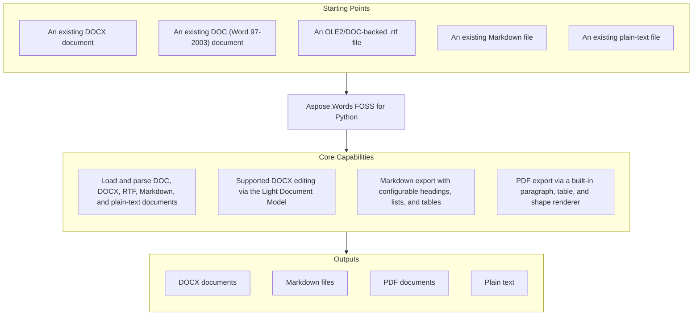

# Aspose.Words FOSS for Python — Unofficial Enhanced Fork

[](#fork-status-and-upstream-differences) [](LICENSE) [](aspose/words_foss/pdf_writer/fonts/OFL.txt)

> **非官方增强版说明：** 本仓库基于官方 Aspose.Words FOSS for Python 项目进行增强，
> 不是 Aspose 官方发布版。当前增强包括中文/Unicode PDF、排版修复、诊断及受限转换入口；字体、依赖和
> 许可证构成与所基于的官方版本存在差异。请安装本仓库的 `dev` 分支，并以本文档和
> 本仓库测试为准；官方 PyPI 包和官方文档不能代表本增强版的行为。

This repository is an independently maintained enhanced fork of
[the official Aspose.Words FOSS for Python project](https://github.com/aspose-words-foss/Aspose.Words-FOSS-for-Python).
The original library and its authors are credited; this fork is **not an official Aspose release**.
Its default development branch is `dev`.

The library reads DOCX, DOC (Word 97-2003), OLE2/DOC-backed RTF, Markdown, and plain-text files
into a shared Light Document Model, and exports that model to DOCX, Markdown, PDF, or plain text —
without Microsoft Word or COM/Office automation. It retains the familiar `Document` / `SaveFormat`
API shape, but does not guarantee identical behavior or output to upstream or commercial Aspose.Words.
Library code remains MIT-licensed; bundled PDF fonts are separately OFL-1.1-licensed.

## Navigation

- [Fork Status and Upstream Differences](#fork-status-and-upstream-differences)
- [At a Glance](#at-a-glance)
- [Key Capabilities](#key-capabilities)
- [Installation](#installation)
- [Dependencies](#dependencies)
- [Quick Start](#quick-start)
- [Enhanced Conversion and Safety](docs/enhanced-conversion.md)
- [Upgrade Notes](docs/upgrade-notes.md)
- [Optimization and Verification Report](docs/optimization-report.md)
- [Additional Examples](#additional-examples)
- [API Reference](#api-reference)
- [Documentation & Resources](#documentation--resources)
- [Scope and Limitations](#scope-and-limitations)
- [Development and Testing](#development-and-testing)
- [License](#license)

## Fork Status and Upstream Differences

This fork started from upstream revision
[`2d2efee2787cb9e56d071d17f8d7b740dce8b784`](https://github.com/aspose-words-foss/Aspose.Words-FOSS-for-Python/commit/2d2efee2787cb9e56d071d17f8d7b740dce8b784).
The comparison below is against that imported revision, **not a claim about the latest upstream
release**. Fork changes are maintained independently on
[`dev`](https://github.com/shenyankm/Aspose.Words-FOSS-for-Python/tree/dev).

| Area | Imported upstream revision | This enhanced fork |
|---|---|---|
| Chinese / Unicode PDF text | Latin-1 conversion replaced unsupported characters, including Chinese, with `?` | Preserves Unicode and common Simplified/Traditional Chinese, mixed Latin text, and punctuation |
| PDF fonts | Word font names mapped to built-in PDF core fonts | Bundled Document Sans SC fonts are subset-embedded; no system-font installation is needed |
| Font styling and layout | Core serif/sans/monospace substitution and x-height scaling | One Unicode family for all text, including code blocks; dedicated bold and derived oblique faces. Original font families, monospace metrics, and pagination can differ |
| Layout | Approximate paragraph height; space-oriented highlight wrapping | Glyph-width wrapping for Chinese highlights/aligned runs; measured paragraph height and largest-run line height |
| Diagnostics and safety | Limited loss diagnostics and unrestricted reads | Missing-glyph/fallback and explicit unsupported-option warnings; bounded reads, guarded resources, atomic main-file output |
| Optional conversion | Built-in LDM renderer | Separate original-file LibreOffice entry point and bounded single-job POSIX CLI |
| Runtime dependency | Declared `fpdf2>=2.7.5` | Requires `fpdf2>=2.8.9` for WOFF fonts; hardened XML and image checks use existing transitive dependencies explicitly |
| Tests | API example suite | Adds Unicode, independent raster/layout, diagnostics, limits and subprocess failure regression tests |
| Distribution and licensing | MIT-licensed library code | `aspose-words-foss-enhanced` / `26.7.0.post2`; MIT code plus OFL-1.1 fonts; full-coverage WOFF resources total about 25 MiB |

This is a targeted PDF enhancement, not full Word layout compatibility or a replacement for the
commercial product. Existing unsupported formats/options remain unsupported; see
[Scope and Limitations](#scope-and-limitations). The source implementation and local tests take
precedence when upstream documentation differs.

## At a Glance



## Key Capabilities

- Open any supported input with a single `Document(filepath)` constructor — the concrete reader is
  chosen automatically from the `.docx`/`.doc`/`.rtf`/`.md`/`.txt` file extension.
- Read DOCX with a pure-Python parser using `zipfile` and entity-protected `defusedxml`;
  embedded raster-image dimensions are checked with Pillow.
- Read legacy Word 97-2003 `.doc` binary files via `olefile`, including OLE2/DOC files carrying an
  `.rtf` suffix. Standard text RTF is rejected with a LibreOffice PDF-conversion hint.
- Parse Markdown on import with `MarkdownReader`, not just read it as literal text — headings, lists,
  emphasis, tables, block quotes, fenced code blocks, links, and base64-embedded images all become
  proper document-model nodes, so a loaded `.md` file converts to DOCX or PDF like any other input.
- Supported DOCX editing: `DocumentReader` builds a shared Light Document Model, and `LdmDocxWriter`
  reconstructs DOCX with default headers/footers, inline shapes/images, bookmarks, complex-field
  markers, grid spans and custom paragraph styles. This is **not arbitrary lossless round-tripping**:
  footnotes, comments, tracked changes and header/footer variants can be lost. Known losses warn.
  For bounded literal edits that retain original package parts, use `docx_edit.replace_text()`.
- Original-package DOM editing: `DocxDocument` binds typed nodes to retained OOXML, supports
  plain paragraph/run/table structure, direct font/paragraph formatting, literal cross-run
  replacement, explicit paragraph-local text ranges and boundary-run splitting. Supported effective
  formatting follows document defaults and paragraph/character style chains with OOXML toggle semantics.
  Unmodified part payloads remain byte-identical; unknown XML is retained.
  This is a bounded DOM, **not a complete Word DOM**.
  See [DOCX DOM usage and boundaries](docs/docx-dom.md).
- Convert image-containing documents — inline images, captioned images, images in tables, and
  images in headers/footers — to every output format: images embed as base64 data URIs in
  Markdown by default, render through the built-in `ShapeRenderer` in PDF, and round-trip
  losslessly through DOCX.
- Export to Markdown with `LdmMarkdownWriter`: headings, bold/italic/underline/strikethrough runs,
  ordered and nested unordered lists, tables, block quotes, code blocks, and hyperlinks, all tunable
  through `MarkdownSaveOptions`.
- Export to PDF with `LdmPdfWriter` — a built-in paragraph, table, and shape renderer (backed by
  `fpdf2`) that needs no external PDF engine or system fonts, configurable through `PdfSaveOptions`.
  Bundled Unicode fonts support common Simplified/Traditional Chinese, Latin text, and punctuation;
  PDF font subsets are embedded automatically.
- Extract plain text from any loaded document with `Document.get_text()`, or save it directly with
  `SaveFormat.TEXT`.
- Configure DOCX packaging through `OoxmlSaveOptions`: compression level, ECMA-376/ISO 29500
  Transitional compliance, and pretty-printed XML.
- Inspect the parsed document model directly — sections, paragraphs, runs, tables, styles, and
  numbered/bulleted lists are typed Pydantic models reachable from `Document.light_document_model`.
- Render to memory with `Document.to_bytes(format_or_options)`, export ordered JSON-safe content
  with `Document.to_dict()`, and inspect structured warnings via `Document.diagnostics`.
- Keep mixed text, links and images inside PDF table grids; repeat leading header rows and split
  oversized rows at content-line boundaries. These improvements do not promise Word-identical layout.

## Installation

### Install this enhanced fork

Install from this repository's `dev` branch, preferably in a separate virtual environment:

```bash
pip install "git+https://github.com/shenyankm/Aspose.Words-FOSS-for-Python.git@dev"
```

For reproducible deployments, replace `@dev` with the full commit hash you have tested.
For local development, clone this fork rather than the upstream repository:

```bash
git clone --branch dev https://github.com/shenyankm/Aspose.Words-FOSS-for-Python.git
cd Aspose.Words-FOSS-for-Python
pip install -e ".[dev]"
```

**`pip install aspose-words-foss` installs the upstream PyPI distribution, not this fork.**
This fork uses the distinct distribution name **`aspose-words-foss-enhanced`** and version
**`26.7.0.post2`**, but retains the compatible import namespace **`aspose.words_foss`**.
It is distributed from this Git repository; do not assume a same-named PyPI package is this fork.
The shared import namespace still prevents safe side-by-side installation with upstream.
Use a clean environment (or uninstall upstream first); pip does not detect this namespace collision.
Installing/upgrading either distribution can overwrite shared modules, and uninstalling either can remove them.

Requires Python 3.10–3.14; runtime dependencies install automatically via pip — see
[Dependencies](#dependencies) below.

Verify the enhanced version, distribution metadata, and imported upstream revision:

```bash
python -c "import aspose.words_foss as aw; from importlib.metadata import version; print(aw.__version__, version('aspose-words-foss-enhanced'), aw.__upstream_revision__)"
```

## Dependencies

### Required Package Dependencies

- `olefile` >=0.46 — reads legacy Word 97-2003 .doc binary files and RTF documents via OLE2 delegation.
- `fpdf2` >=2.8.9 — backs the built-in PDF renderer and compressed WOFF font support.
- `pydantic` >=2.0.0 — the typed model layer for the parsed document model.
- `defusedxml` >=0.7.1 — rejects XML entity expansion in DOCX/SVG input.
- `Pillow` >=10.0.0 — validates raster-image dimensions and supports rendering.

### Optional Text Shaping

Install this fork with the `shaping` extra to enable HarfBuzz-based shaping and bidirectional text:

```bash
pip install "aspose-words-foss-enhanced[shaping] @ git+https://github.com/shenyankm/Aspose.Words-FOSS-for-Python.git@dev"
```

Then set `PdfSaveOptions.text_shaping = True` (or use CLI `--text-shaping`).
Deploy trusted fallback fonts covering the target language; the extra does not supply fonts.
See [upgrade notes](docs/upgrade-notes.md#5-可选多语言塑形) for usage and limitations.

### Native and System Requirements

- Requires Python 3.10–3.14 (`pyproject.toml` caps at `<3.15`). CI is configured for each supported version on Linux, Windows and macOS; this does not establish that the matrix has passed. Actual local verification results and untested platforms are listed in the [optimization report](docs/optimization-report.md).

### Development Dependencies

- `PyMuPDF>=1.24.0` — independently rasterizes PDFs and checks text bounds in layout tests.
- `pytest>=9.0.2` — the test runner used to execute `tests/` and `ApiExamples/`.
- `pypdf>=5.0.0` — checks PDF links, extracted Unicode text, and embedded fonts in tests.

None of these are required to install or use this fork at runtime; they apply only when
installing with `pip install -e ".[dev]"` for local development and testing.

## Quick Start

Load a document and export it to Markdown:

```python
import aspose.words_foss as aw

doc = aw.Document("report.docx")  # or .doc, .rtf, .txt, .md
doc.save("report.md", aw.SaveFormat.MARKDOWN)
```

Export the same document to PDF:

```python
import aspose.words_foss as aw

doc = aw.Document("report.docx")
doc.save("report.pdf", aw.SaveFormat.PDF)
```

```python
from dataclasses import asdict

pdf_bytes = doc.to_bytes(aw.SaveFormat.PDF)  # no intermediate file
content = doc.to_dict()                   # ordered body blocks + model locations
warnings_report = [asdict(item) for item in doc.diagnostics]
```

See [upgrade notes](docs/upgrade-notes.md) for original-package edits, optional text shaping,
structured output, benchmarks and template integration.
See [enhanced conversion and safety](docs/enhanced-conversion.md) for fallback fonts, diagnostic
warnings, input limits, atomic saves, the bounded CLI, and optional original-file LibreOffice rendering.
These are fork extensions, not upstream API guarantees.

More runnable scripts — covering every input/output format combination, `MarkdownSaveOptions`, PDF
export, plain-text export, and image-containing documents — are collected in
[`ApiExamples/`](ApiExamples/); see [Additional Examples](#additional-examples) below.

## Additional Examples

More real, runnable examples are collected below, matching the standalone scripts under
[`ApiExamples/`](ApiExamples/).

### Save With Markdown and PDF Options

```python
import aspose.words_foss as aw

doc = aw.Document("report.docx")

md_opts = aw.saving.MarkdownSaveOptions()
md_opts.export_underline_formatting = True
doc.save("report.md", md_opts)

pdf_opts = aw.saving.PdfSaveOptions()
doc.save("report.pdf", pdf_opts)
```

<details>
<summary>View Additional Examples</summary>

| File | What it shows |
|------|---------------|
| `convert_document.py` | Every input format (DOCX, DOC, RTF, TXT, MD) to every output format (Markdown, PDF, TXT) |
| `loading_document.py` | Loading documents from a file path and from a binary stream, with `LoadOptions` |
| `loading_markdown.py` | Reading Markdown from in-memory content |
| `working_with_markdown_save_options.py` | `MarkdownSaveOptions` — `export_underline_formatting`, `encoding`, `paragraph_break` |
| `working_with_ooxml_save_options.py` | `OoxmlSaveOptions` for DOCX export — `pretty_format`, `compression_level`, `zip_64_mode` |
| `working_with_pdf_save_options.py` | PDF export from all input formats |
| `working_with_txt_save_options.py` | Plain-text export and `get_text()` |
| `working_with_images.py` | Image-containing documents to all output formats |
| `template_report.py` | Trusted DOCX templates and JSON context via optional `docxtpl`, followed by PDF export |

### Extract Plain Text

```python
import aspose.words_foss as aw

doc = aw.Document("report.docx")
text = doc.get_text()
print(text)
```

### Convert Every Input Format to PDF

```python
import aspose.words_foss as aw

for path in ("report.docx", "legacy.doc", "notes.rtf"):
    doc = aw.Document(path)
    doc.save(f"{path}.pdf", aw.SaveFormat.PDF)
```

### Load From a Stream

DOCX, DOC, and RTF are auto-detected from magic bytes; formats with no magic bytes (like Markdown)
need `LoadOptions.load_format` to disambiguate:

```python
import io
import aspose.words_foss as aw

with io.FileIO("report.docx") as stream:
    doc = aw.Document(stream)  # DOCX / DOC / RTF from magic bytes

opts = aw.LoadOptions()
opts.load_format = aw.LoadFormat.MARKDOWN  # needed for .md, which has no magic bytes
with io.FileIO("notes.md") as stream:
    doc = aw.Document(stream, opts)
```

### Preserve a UTF-8 BOM in Markdown Output

```python
import aspose.words_foss as aw

doc = aw.Document("report.docx")
md_opts = aw.saving.MarkdownSaveOptions()
md_opts.encoding = "utf-8-sig"
doc.save("report.md", md_opts)
```

### Pretty-Print DOCX XML

```python
import aspose.words_foss as aw

doc = aw.Document("report.docx")
ooxml_opts = aw.saving.OoxmlSaveOptions()
ooxml_opts.pretty_format = True
doc.save("report-pretty.docx", ooxml_opts)
```

### Set DOCX Compression Level

```python
import aspose.words_foss as aw

doc = aw.Document("report.docx")
ooxml_opts = aw.saving.OoxmlSaveOptions()
ooxml_opts.compression_level = aw.saving.CompressionLevel.MAXIMUM
doc.save("report-max-compression.docx", ooxml_opts)
```

### Convert Image-Containing Documents to Every Output Format

Inline images, captioned images, images inside tables, and images in headers/footers all convert
cleanly across every output format:

```python
import aspose.words_foss as aw

image_containing_files = [
    "simple_inline.docx",
    "image_with_caption.docx",
    "image_in_table.docx",
    "image_in_header.docx",
    "image_in_footer.docx",
]
for filename in image_containing_files:
    doc = aw.Document(filename)
    doc.save(f"{filename}.md", aw.SaveFormat.MARKDOWN)   # images embed as base64 by default
    doc.save(f"{filename}.pdf", aw.SaveFormat.PDF)        # rendered via ShapeRenderer
    doc.save(f"{filename}.txt", aw.SaveFormat.TEXT)
```

### Load Markdown From In-Memory Content

`MarkdownLoadOptions` (not the generic `LoadOptions`) loads Markdown directly from bytes or a
stream — no file path required — and adds a `preserve_empty_lines` option that keeps blank lines
which would otherwise collapse during parsing:

```python
import io
import aspose.words_foss as aw

markdown_bytes = b"# Release Notes\n\nThis build adds **bold** and *italic* support.\n"

load_opts = aw.MarkdownLoadOptions()
doc = aw.Document(io.BytesIO(markdown_bytes), load_opts)
print(doc.get_text())

load_opts.preserve_empty_lines = True
doc = aw.Document(
    io.BytesIO(b"# Title\n\n\nParagraph after two blank lines.\n"), load_opts
)
```

A Markdown source with a base64-embedded image and links round-trips to real content, not
literal Markdown syntax — the image becomes a genuine embedded shape and each link becomes a real
clickable hyperlink, in both DOCX and PDF output:

```python
import io
import aspose.words_foss as aw

markdown_with_image = (
    "# Report\n\n"
    "\n\n"
    "See the [documentation](https://example.com/docs) for details.\n"
)

doc = aw.Document(io.BytesIO(markdown_with_image.encode("utf-8")), aw.MarkdownLoadOptions())
doc.save("report.docx", aw.SaveFormat.DOCX)  # image becomes a real embedded Shape
doc.save("report.pdf", aw.SaveFormat.PDF)    # link becomes a real clickable PDF annotation
```

</details>

## API Reference

`Document` is the primary entry point: construct it from a file path, then call `save()` with a
`SaveFormat` constant or a `MarkdownSaveOptions` / `PdfSaveOptions` / `OoxmlSaveOptions` instance —
the target format is otherwise inferred from the output file's extension.
The DOC/DOCX/RTF/Markdown/Text readers, DOCX/Markdown/PDF writers, and shared Light Document Model
are summarized in the module-grouped table below.

### Fork Extension APIs

| API | Behavior and boundary |
|---|---|
| `Document.to_bytes(format_or_options)` | Returns DOCX/PDF/Markdown/TEXT bytes; an explicit format is required. TEXT is UTF-8; Markdown honors its encoding option. External Markdown image files require `save()` instead. |
| `Document.to_dict()` | Returns JSON-safe content with `schema_version`, `source`, ordered `blocks`, `headers_footers`, and a snapshot of `diagnostics`. Locations are model paths, not page coordinates; source paths and text may be sensitive. |
| `Document.diagnostics` | Accumulates `ConversionDiagnostic` records from loading and each save/render, including detected warnings before failure. Repeated conversions can add repeated records; this is not a complete fidelity audit. |
| `ConversionDiagnostic` | Frozen dataclass with `code`, `severity`, `location`, and `message`; use `dataclasses.asdict()` for JSON serialization. |
| `ConversionWarning` / `ContentLossWarning` | Public warning bases available under `aspose.words_foss`; content-loss filters do not catch missing glyphs, which require `PdfMissingGlyphWarning` separately. |
| `docx_edit.replace_text(source, destination, replacements)` | Separate original-package edit API; returns replacement count. Literal matches must fit inside one `w:t` node, and every key must occur. Retains unknown parts; not a sanitizer. |
| `DocxDocument(source)` | Original-package DOM for bounded text, direct-format and simple structure edits; path or binary stream input. `Paragraph.range(start, end)` selects text for replacement or local formatting; `Run.effective_font` and `Paragraph.effective_paragraph_format` resolve supported inherited properties. `save(path)` / `to_bytes()` retain unmodified parts, `to_light_document()` produces an independent conversion snapshot. See [DOM guide](docs/docx-dom.md). |

Examples and complete boundaries are in [upgrade notes](docs/upgrade-notes.md).

<details>
<summary>View the Supported Public API Surface</summary>

### Core API

| Class | Description |
|---|---|
| `Body` | Class with 2 properties. |
| `BookmarkEnd` | Class with 2 properties. |
| `BookmarkStart` | Marks the beginning of a Word bookmark (`<w:bookmarkStart>`). |
| `Border` | Class with 3 properties. |
| `Cell` | Class with 4 properties. |
| `CellFormat` | Class with 14 properties. |
| `ColorMode` | Color rendering mode. |
| `CompressionLevel` | Compression level for OOXML files. |
| `ConversionOptions` | Options for controlling DOCX to Markdown conversion. |
| `DocList` | Class with 4 properties. |
| `Document` | Represents a Word document. |
| `Document-light_document_model` | Class with 2 methods and 13 properties. |
| `DocumentFormatReader` | Protocol defining the interface all document readers must implement. |
| `FieldEnd` | Class with 3 properties. |
| `FieldSeparator` | Class with 2 properties. |
| `FieldStart` | Class with 2 properties. |
| `Font` | Class with 23 properties. |
| `FrameFormat` | Floating text-frame definition. |
| `HeaderFooter` | Class with 5 properties. |
| `ImageData` | Class with 7 properties. |
| `LdmMarkdownWriter` | Converts a `light_document_model.Document` to a Markdown string. |
| `ListFormat` | Class with 3 properties. |
| `ListLabel` | Snapshot of a list-item's rendered bullet/number label. |
| `ListLevel` | Class with 9 properties. |
| `ListLevelOverride` | One `<w:lvlOverride>` inside a concrete `<w:num>`. |
| `LoadFormat` | Document load format constants. |
| `MarkdownEmptyParagraphExportMode` | Controls how empty paragraphs are exported. |
| `MarkdownExportAsHtml` | Controls which elements are exported as raw HTML. |
| `MarkdownFileReader` | Reads Markdown (.md) files and yields one Paragraph per line. |
| `MarkdownLinkExportMode` | Link export mode options. |
| `MarkdownListExportMode` | List export mode options. |
| `MarkdownSaveOptions` | Options for saving documents as Markdown. |
| `OoxmlCompliance` | OOXML standards compliance level. |
| `OoxmlSaveOptions` | Options for saving a document as DOCX (Office Open XML). |
| `OutlineOptions` | Controls how outlines (bookmarks panel) are generated in the PDF. |
| `PageSetup` | Class with 18 properties. |
| `Paragraph` | A paragraph whose children — `Run`, `BookmarkStart` / `End`, `FieldStart` / `Separator` / `End` and inline `ShapeNode` — sit in a single ordered collection in document order. |
| `ParagraphFormat` | Class with 35 properties. |
| `ParagraphInfo` | Information about a paragraph's style and context. |
| `PdfCompliance` | PDF standards compliance level. |
| `PdfFontEmbeddingMode` | Font embedding mode in PDF. |
| `PdfImageCompression` | Image compression in PDF. |
| `PdfPageMode` | PDF page display mode. |
| `PdfSaveOptions` | Options for saving documents as PDF. |
| `PdfTextCompression` | Text compression in PDF. |
| `PdfZoomBehavior` | Mirrors public API. |
| `Row` | Class with 3 properties. |
| `RowFormat` | Class with 7 properties. |
| `RtfFileReader` | Reads RTF files (OLE2-format) and produces the same data structures as DocumentReader (for .docx) and DocFileReader (for .doc). |
| `Run` | Class with 3 properties. |
| `RunFormatting` | Text run formatting properties. |
| `SaveFormat` | Document save format constants. |
| `Section` | Class with 4 properties. |
| `Shading` | Class with 2 properties. |
| `ShapeNode` | Class with 25 properties. |
| `Style` | Class with 11 properties. |
| `TabStop` | Class with 4 properties. |
| `TabStopCollection` | Class with 5 methods and 1 property. |
| `Table` | Class with 11 properties. |
| `Table-models` | Represents a table structure. |
| `TableCell` | Represents a table cell. |
| `TableContentAlignment` | Table content alignment options. |
| `TableRow` | Represents a table row. |
| `TableStyleFormat` | Table-level properties stored on table styles (`w:tblPr` inside `w:style`). |
| `TextColumn` | Class with 2 properties. |
| `TextColumns` | Class with 5 properties. |
| `TextFileReader` | Reads plain-text (.txt) files and yields one Paragraph per line. |
| `UnknownNode` | Class with 1 property. |
| `Zip64Mode` | Controls when to use ZIP64 format extensions for OOXML files. |

#### Enumerations

| Enumeration | Description |
|---|---|
| `CodeBlockStyle` | Code block style preference. |
| `HeadingStyle` | Heading export style preference. |
| `ListMarker` | Bullet list marker style. |

### Converters

| Class | Description |
|---|---|
| `ListHandler` | Handles parsing and conversion of lists. |
| `ParagraphConverter` | Handles conversion of paragraphs to Markdown. |
| `TableConverter` | Handles conversion of tables to Markdown. |

### DOC Reader

| Class | Description |
|---|---|
| `BlipInfo` | Parsed BSE (Blip Store Entry) with location of image data. |
| `CharProps` | Properties extracted from CHPX for a text run. |
| `ChildAnchorInfo` | Position of a child shape within its parent group's coordinate system. |
| `DocFileReader` | Full DOC reader with LDM (Light Document Model) building capability. |
| `DocFileReaderCore` | Core reader for Word 97-2003 (.doc) files. |
| `DocTableBuilderMixin` | Mixin that adds table-building helpers to the DOC reader. |
| `FibData` | Parsed FIB (File Information Block) data. |
| `GroupShapeInfo` | Coordinate system of a shape group (from Spgr record). |
| `ListDef` | Parsed list definition with full level information. |
| `ListLevelData` | One parsed LVL record (measurements in points). |
| `ParaProps` | Properties extracted from PAPX for a single paragraph. |
| `ShapeAnchor` | Parsed SPA (Shape Address) from PlcSpaMom / PlcSpaHdr. |
| `ShapeLineProps` | Escher line/fill properties for a shape (from FOpt records). |
| `StyleData` | Properties parsed from a style definition (STSH UPX). |
| `TableRowProps` | Properties extracted from PAPX SPRMs on table row-end paragraphs. |

### DOCX Reader

| Class | Description |
|---|---|
| `CellBuilder` | Build `ldm.Cell` from a `<w:tc>` element. |
| `CellData` | Table cell. |
| `DocumentReader` | Reads DOCX documents and produces abstracted data structures. |
| `FontBuilder` | Build a non-cascaded `ldm.Font` from one `<w:rPr>`. |
| `FontResolver` | Compose a fully cascaded `ldm.Font`. |
| `LdmBuilderMixin` | Mixin that adds `to_light_document` to `DocumentReader`. |
| `ListBuilder` | Translate `<w:numbering>` into a list of `ldm.DocList`. |
| `NumberingInfo` | Numbering definition. |
| `NumberingLevel` | List level definition. |
| `PageSetupBuilder` | Build `ldm.PageSetup` from a `<w:sectPr>` element. |
| `ParagraphBuilder` | Build `ldm.Paragraph` from a `<w:p>` element. |
| `ParagraphData` | Paragraph with style and content. |
| `ParagraphFormatBuilder` | Build a non-cascaded `ldm.ParagraphFormat` from one `<w:pPr>`. |
| `ParagraphFormatResolver` | Compose a fully cascaded `ldm.ParagraphFormat`. |
| `ReaderContext` | Class extending Protocol. |
| `RowBuilder` | Build `ldm.Row` from a `<w:tr>` element. |
| `RowData` | Table row. |
| `RunBuilder` | Build a single `ldm.Run` with a resolved font cascade. |
| `RunData` | Text run with formatting. |
| `SectionBuilder` | Split the body into `ldm.Section` objects at sectPr boundaries. |
| `ShapeParserMixin` | Mixin providing drawing/shape parsing methods for DocumentReader. |
| `StyleBuilder` | Translate `<w:styles>` into a list of `ldm.Style`. |
| `StyleChainResolver` | Walk the `<w:basedOn>` graph for a styleId. |
| `TableBuilder` | Build `ldm.Table` from a `<w:tbl>` element. |
| `TableData` | Table structure. |

### DOCX Writer

| Class | Description |
|---|---|
| `BookmarkState` | Hands out monotonically increasing bookmark ids and pairs starts/ends across paragraphs. |
| `DocxWriterLossyWarning` | Warns the caller that the writer is dropping known LDM constructs. |
| `ImageEntry` | One image to add to `word/media/` plus its relationship row. |
| `ImageRenderState` | Accumulator threaded through paragraph rendering for inline shapes. |
| `LdmDocxWriter` | Convert an `ldm.Document` into a DOCX file. |

### Model

| Class | Description |
|---|---|
| `CellMerge` | Specifies how a cell in a table is merged with other cells. |
| `CellVerticalAlignment` | Specifies vertical justification of text inside a table cell. |
| `HeightRule` | Specifies the rule for determining the height of an object. |
| `LineSpacingRule` | Specifies values for line spacing. |
| `LineStyle` | Specifies line style of a border. |
| `NumberStyle` | Specifies the number style for a list, footnotes, endnotes, page numbers. |
| `Orientation` | Specifies page orientation. |
| `ParagraphAlignment` | Specifies text alignment in a paragraph. |
| `SectionStart` | Specifies the type of break at the beginning of the section. |
| `StyleIdentifier` | Locale-independent built-in style identifier. |
| `StyleType` | Specifies type of the style. |
| `TabAlignment` | Tab stop alignment. |
| `TabLeader` | Tab stop leader character. |
| `Underline` | Specifies type of the underline applied to a font. |
| `WrapType` | Specifies how text is wrapped around a shape or picture. |

### Parsers

| Class | Description |
|---|---|
| `ListInfo` | Information about a list. |
| `ListLevelInfo` | Information about a list level. |
| `NumberingParser` | Parser for DOCX numbering definitions. |
| `ParsedStyle` | Parsed style information. |
| `StyleParser` | Parser for DOCX style names and properties. |

### PDF Writer

| Class | Description |
|---|---|
| `LdmPdfWriter` | Converts a `light_document_model.Document` to a PDF file. |
| `PDFWriterContext` | Protocol requiring a `PdfSaveOptions` options property. |
| `ParagraphRenderer` | Renders LDM paragraphs into PDF. |
| `RunRenderer` | Renders formatted runs (text segments with fonts, colors, links). |
| `ShapeRenderer` | Renders shapes, images, and positioned elements. |
| `TableRenderer` | Renders LDM tables into PDF. |

---

#### Detailed Member Reference

### Document Loading and Saving

- `Document(filepath=None, *, stream=None, data=None)` — loads a `.doc`, `.docx`, `.rtf`, `.txt`, or
  `.md` file (or DOCX bytes/stream) and populates the Light Document Model immediately at
  construction time.
  - `light_document_model: ldm.Document` — the underlying parsed model
  - `sections`, `first_section`, `last_section`, `styles`, `lists`, `page_count`
  - `get_text() -> str` — plain-text extraction
  - `save(output_path, save_format_or_options=None)` — accepts a `SaveFormat` constant or a
    `MarkdownSaveOptions` / `PdfSaveOptions` / `OoxmlSaveOptions` instance; otherwise the target
    format is inferred from the output file's extension
- `SaveFormat`: `MARKDOWN`, `DOC` (reserved for API compatibility, not implemented — see
  [Scope and Limitations](#scope-and-limitations)), `DOCX`, `TEXT`, `PDF`
- `LoadFormat`: `AUTO`, `DOC`, `DOCX`, `RTF`, `TEXT`, `MARKDOWN`

### Format Readers

- `DocumentReader` (DOCX) — combines `LdmBuilderMixin` and `ShapeParserMixin`; `load_file()` /
  `load_stream()` / `load_bytes()`, then `to_light_document()`
- `DocFileReader` (DOC, Word 97-2003 binary) — combines `DocTableBuilderMixin` and
  `DocFileReaderCore`, backed by `olefile`
- `RtfFileReader` — OLE2-delegated RTF reader with the same `to_light_document()` contract
- `MarkdownFileReader`, `TextFileReader` — yield one `Paragraph` per line
- `DocumentFormatReader` — the `Protocol` all four readers implement

### Markdown Export

- `LdmMarkdownWriter.write(doc, output_path) -> str`
- `MarkdownSaveOptions` — `heading_style` (`HeadingStyle.ATX` / `SETEXT`), `list_marker`
  (`ListMarker.DASH` / `ASTERISK` / `PLUS`), `code_block_style`, `table_content_alignment`,
  `link_export_mode`, `export_as_html`, `export_underline_formatting`, `export_images_as_base64`,
  `encoding`, `paragraph_break`

### PDF Export

- `LdmPdfWriter.write(doc, output_path) -> None`
- `PdfSaveOptions` — `compliance`, `export_document_structure`, `image_compression`,
  `jpeg_quality`, `zoom_factor`, `zoom_behavior`, `export_bookmarks_outline`, `outline_options`,
  `display_doc_title`, `fallback_fonts`; `compliance` selects the PDF version, not PDF/A or PDF/UA
  conformance. `text_compression`, `embed_full_fonts`,
  `use_core_fonts`, `font_embedding_mode`, `page_mode`, `color_mode`, `preserve_form_fields`, and
  `memory_optimization` (accepted but not implemented; explicit assignment warns — see
  [Scope and Limitations](#scope-and-limitations))
- `ParagraphRenderer`, `RunRenderer`, `TableRenderer`, `ShapeRenderer` — the internal rendering
  pipeline `LdmPdfWriter` drives, built on `fpdf2`

### DOCX Round-Trip Writing

- `LdmDocxWriter.write(doc, output_path) -> None` / `write_to_bytes(doc) -> bytes`
- `OoxmlSaveOptions` — `compliance` (`OoxmlCompliance.ECMA376_2006` / `ISO29500_2008_TRANSITIONAL`;
  `ISO29500_2008_STRICT` is not implemented), `compression_level` (`CompressionLevel.NORMAL` /
  `MAXIMUM` / `FAST` / `SUPER_FAST`), `zip_64_mode`, `pretty_format`
- `DocxWriterLossyWarning` — a `UserWarning` subclass callers can opt into with
  `warnings.simplefilter("error", DocxWriterLossyWarning)`

### Document Object Model

- `Document` (LDM) — `all_paragraphs`, `tables`, `all_tables`, `text`, `styles`, `lists`,
  `sections`, `header_paragraphs`, `footer_paragraphs`, `find_style(name)`, `headings(max_level)`
- `Section` — `page_setup`, `body`, `headers_footers`
- `Paragraph` — `runs`, `paragraph_format`, `list_format`, `list_label`, `text`
- `Table` / `Row` / `Cell` — `rows`, `cells`, `cell_format`, `row_format`
- `Style` — `paragraph_format`, `font`, `base_style_name`, `built_in`
- `Font` / `ParagraphFormat` / `PageSetup` — cascaded formatting attributes resolved during DOCX
  read

### Enums

- `LineStyle`, `LineSpacingRule`, `HeightRule`, `CellMerge`, `CellVerticalAlignment`, `Orientation`,
  `ParagraphAlignment`, `SectionStart`, `StyleType`, `StyleIdentifier`, `TabAlignment`, `TabLeader`,
  `Underline`, `WrapType`

</details>

## Documentation & Resources

- **This fork:** this README, [upgrade notes](docs/upgrade-notes.md),
  [conversion and safety](docs/enhanced-conversion.md), [`ApiExamples/`](ApiExamples/), and
  [`tests/test_pdf_unicode.py`](tests/test_pdf_unicode.py) describe the enhanced behavior.
- **Verification:** [optimization report](docs/optimization-report.md) separates the initial
  post2 test/wheel results from the later missing-glyph optimization checks. The
  [post1 verification report](docs/verification-report.md) is historical, not current validation.
- **[Fork issues](https://github.com/shenyankm/Aspose.Words-FOSS-for-Python/issues)** — report
  enhancement-specific bugs and requests here, not to the official project as if this were its release.
- **[Official upstream repository](https://github.com/aspose-words-foss/Aspose.Words-FOSS-for-Python)**
  and **[upstream PyPI package](https://pypi.org/project/aspose-words-foss/)** — original source and releases.
- **Upstream documentation:** [getting started](https://docs.aspose.org/words/python/),
  [how-to guides & FAQ](https://kb.aspose.org/words/python/), and
  [API reference](https://reference.aspose.org/words/python/). These are upstream resources,
  not documentation for this fork's enhancements, font substitution, or dependency requirements.
- Many API examples use the familiar commercial
  [`aspose-words`](https://github.com/aspose-words/Aspose.Words-for-Python-via-.NET) API shape.
  Similar imports and method names do not guarantee matching features, rendering, or behavior.

## Scope and Limitations

- RTF loading delegates to the DOC/OLE2 reader; it is not a general parser for text-based
  `{\rtf...}` files. Such input now fails explicitly; use the original-file LibreOffice PDF path.
- PDF export substitutes the bundled Document Sans SC family for source fonts, including code
  blocks. Bold uses a dedicated bold face; italic uses a derived oblique face. Original font
  families, monospace metrics, and exact Word pagination are not preserved. The four full-coverage
  WOFF resources total approximately 25 MiB. Missing characters warn; configure trusted fallback
  fonts or treat the warning as an error. Emoji and complex-script rendering are not universally supported.
- `SaveFormat.DOC` is defined as a save-format constant for API compatibility with the commercial
  product, but `Document.save()` does not implement a DOC writer — `.doc` files can be read, not
  written. Saving with an unsupported target raises `ValueError` (`Markdown`, `Text`, `PDF`, and
  `DOCX` are the four save formats actually implemented).
- Saving DOCX with `OoxmlSaveOptions.compliance` set to `OoxmlCompliance.ISO29500_2008_STRICT` is
  not implemented — the writer raises `NotImplementedError` rather than silently emitting
  non-strict output. Use `ECMA376_2006` or `ISO29500_2008_TRANSITIONAL` instead, both of which this
  edition treats as producing the same, compliant output.
- Eight `PdfSaveOptions` fields — `text_compression`, `embed_full_fonts`, `use_core_fonts`,
  `font_embedding_mode`, `page_mode`, `color_mode`, `preserve_form_fields`, and
  `memory_optimization` — exist for API forward-compatibility with the commercial Aspose.Words
  API and are not applied by the PDF writer; explicit assignments emit `PdfUnsupportedOptionWarning`.
- Input limits, local-image opt-in, new-file permissions, resource isolation and optional native-backend
  restrictions are documented in [enhanced conversion and safety](docs/enhanced-conversion.md).
  These checks are not a complete security sandbox or a full Word compatibility validator.

For DOC writing, strict ISO 29500 compliance, and the additional load/save formats and page-layout
features beyond this edition's scope, see
[Aspose.Words for Python — Enterprise Edition](https://products.aspose.com/words/python-net/),
a separate commercial product. It is not this fork and is not guaranteed to be a drop-in replacement.

## Development and Testing

Install the development dependencies and run the example test suite:

```bash
pip install -e ".[dev,shaping]" docxtpl
python -m pytest tests/ -v
python -m pytest ApiExamples/ -v --rootdir=ApiExamples -c ApiExamples/pytest.ini
```

The `shaping` extra and `docxtpl` are optional at runtime; install them above to exercise their
optional tests/examples rather than skipping them. For reproducible performance measurements:

```bash
python scripts/benchmark.py --repeat 3 > benchmark.json
```

See the [optimization report](docs/optimization-report.md) for measured results and
[upgrade notes](docs/upgrade-notes.md#7-工程与性能验证) for installed-wheel verification.

Run an individual example script directly:

```bash
python ApiExamples/convert_document.py
```

Test fixtures live under `tests/data/input/` (shared input files for `ApiExamples/`); generated
output is written to `ApiExamples/output/` (git-ignored).

## License

This project is licensed under the [MIT License](LICENSE). The MIT License permits use, copying,
modification, distribution, sublicensing, and commercial use, provided its copyright and permission
notice are retained. The software is provided without warranty.

Bundled PDF font resources are separately licensed under the
[SIL Open Font License 1.1](aspose/words_foss/pdf_writer/fonts/OFL.txt), not MIT.
See their [provenance and modifications](aspose/words_foss/pdf_writer/fonts/README.md).
